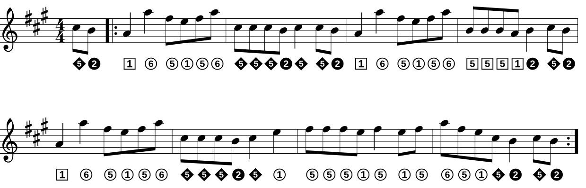
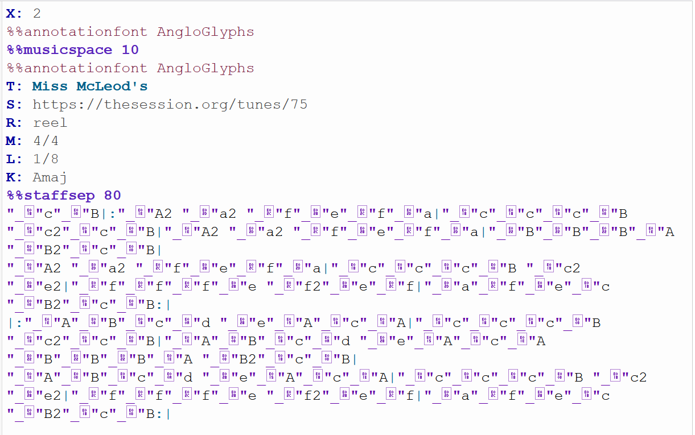
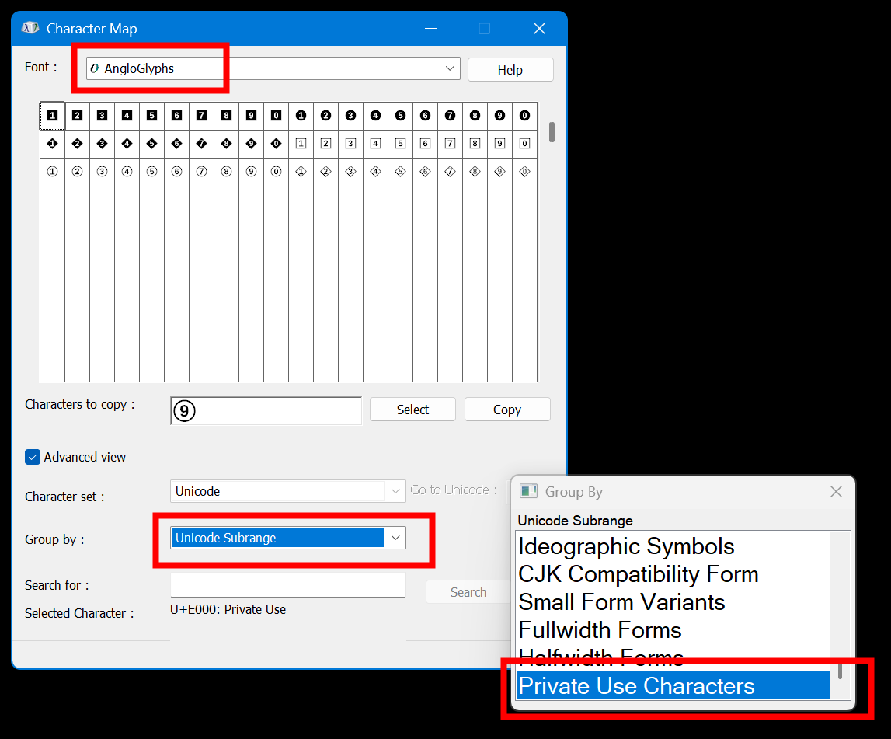

# AngloGlyphs



AngloGlyphs is a font and example library for adding Anglo concertina button annotations to ABC notation or other music notations. It's inspired by the system used in the book "The Anglo Concertina for absolute beginners by Chris Sherburn and Dave Mallinson". I understand the notation system to have been devised by Mally, and while the font is all my own work (with significant AI help), all rights over the notation system itself remain firmly where they belong. I hope the font will be useful to all who have enjoyed the book and wish to continue using the notation in their ongoing musical journey. 

The concertina symbols live in the Unicode **Private Use Area** (often abbreviated **PUA**). That is the correct place for these specialist glyphs: Unicode does not assign standard codepoints for Anglo concertina button symbols, so the font publishes them in private-use codepoint slots instead.

This repository provides:

- `AngloGlyphs.otf`, the font containing the Anglo concertina glyphs
- `abc\`, a growing library of annotated tunes
- `data\manifest\glyphs.json`, the canonical public mapping from notes and buttons to AngloGlyphs codepoints
- `.github\skills\concertina-abc-annotation\`, a Copilot skill for converting or generating ABC under-note annotations

## Licensing

The `AngloGlyphs.otf` font should be treated as a font released under the **SIL Open Font License 1.1 (OFL-1.1)**. The current build pipeline derives numeral and base-font material from **Liberation Sans**, so the resulting font is not an MIT-only artifact.

That OFL licensing applies to the font itself and to modified versions of the font. It does **not** apply to documents created with the font, such as ABC files, PDFs, tune books, or rendered music examples.

For material in `abc\`, the intention is that contributed annotated tunes be shared under **CC BY 4.0**, unless a file clearly says otherwise.

See [LICENSE.md](LICENSE.md) for the repository-wide license map, plus [LICENSES/OFL-1.1.txt](LICENSES/OFL-1.1.txt) and [LICENSES/CC-BY-4.0.txt](LICENSES/CC-BY-4.0.txt) for the full license texts.

## What the font encodes

The glyphs represent Anglo concertina buttons by:

- shape: C-row = square, G-row = circle, accidental row = diamond
- direction: push and pull are separate glyphs
- button number: shown inside the shape

The notation is about the button choice, not left-hand versus right-hand placement.

The published mapping metadata in this repository is for the **Wheatstone** fingering system. Supporting automatic adjustment for **Jeffries** fingering would be a useful future improvement to the annotation skill.

## Installing the font

Install `AngloGlyphs.otf` in the normal way for your operating system.

- **Windows:** right-click the font file and choose **Install** or **Install for all users**
- **macOS:** open the font in Font Book and install it
- **Linux:** copy it into your user or system font directory and refresh the font cache if needed

If a web page or notation tool does not pick the font up immediately, a refresh or browser restart may help.

## Using AngloGlyphs in ABC

The basic ABC directive is:

```abc
%%annotationfont AngloGlyphs
```

Under-note annotations should be quoted strings beginning with `_` and containing one AngloGlyphs glyph:

```abc
%%annotationfont AngloGlyphs
K:Amaj
"_..."A "_..."B "_..."c
```

The exact PUA character to use comes from `data\manifest\glyphs.json`. The example tune in `abc\Miss McLeod's Reel.abc` shows the format in real use. Here you can see that without the font actually in use, the annotations aren't very readable. Scroll down for tips on dealing with that.



## Helpful places to work with ABC

This repository is useful alongside dedicated ABC sites and tune libraries, for example:

- [ABC Transcription Tools](https://michaeleskin.com/abctools/abctools.html)
- [The Session](https://thesession.org/)

A common workflow is:

1. find or edit a tune in one of those tools
2. add or refine AngloGlyphs annotations
3. save the resulting ABC here for reuse and sharing

## Using the Copilot annotation skill

This repo includes a Copilot skill at `.github\skills\concertina-abc-annotation\`.

Use it when you want help to:

- convert an existing annotation system into AngloGlyphs
- annotate an unannotated ABC tune
- check button-to-codepoint mappings
- catch numbering-system mismatches

The skill uses:

- `data\manifest\glyphs.json` as its public source of truth
- files in `abc\` as the normal input and output location

At present, the published mapping data is Wheatstone-based. Jeffries-aware annotation support would be a reasonable future enhancement rather than something to assume silently.

## Customizing the skill to match your preferences

Automatic annotation is useful, but it is not the same thing as a final musical decision. Different players may prefer different tradeoffs for fingering continuity, accidental-row usage, or bellows direction.

If you want the skill to reflect your own preferences:

1. edit `.github\skills\concertina-abc-annotation\SKILL.md` to change the instructions given to Copilot
2. edit `.github\skills\concertina-abc-annotation\references\workflow.md` to document your preferred heuristics or house style
3. keep `data\manifest\glyphs.json` unchanged unless you are intentionally changing the published codepoint mapping

Good candidates for customization include:

- whether to preserve a legacy fingering system
- how strongly to avoid the accidental row
- how strongly to avoid finger hopping
- how much bellows balance should influence automatic choices

## Manual review still matters

Automatically annotated tunes will often benefit from manual edits.

That is expected. The aim is to make annotation easier and more consistent, not to pretend that one automatic pass is always musically ideal.

If you are editing ABC in an app that does not let you choose the annotation font directly, it can be handy to copy and paste AngloGlyphs characters from Windows Character Map. See `Charmap.png`: set **Font** to `AngloGlyphs`, set **Group By** to `Unicode Subrange`, then choose **Private Use Characters** from the Unicode subrange list.



## Contributions

Pull requests are welcome for:

- new annotated tunes
- improvements to existing annotations
- corrections to the published mapping or documentation

If you contribute annotated tune material, please be willing to share your contribution under **CC BY 4.0**.

Please also make sure you have the right to submit the material you are contributing, especially if it is derived from an existing source or includes editorial work from another site or publication.
